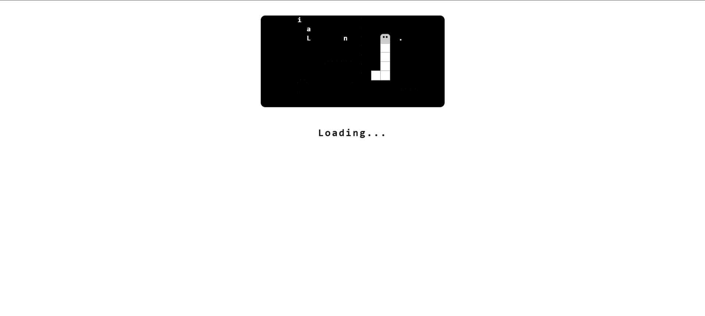
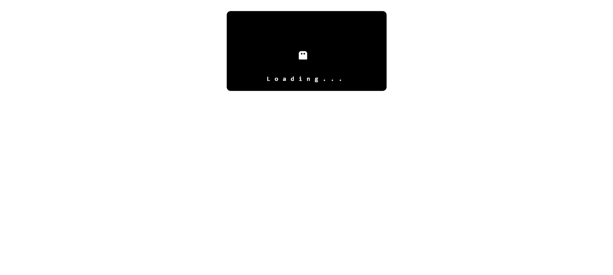

# React Snake Loader

A fun, animated snake loader component for React applications. The snake "eats" the letters of the loading text, providing a playful and engaging loading experience.

## Features

- Animated snake game as a loading spinner
- Responsive design (works on desktop and mobile)
- Customizable background image and text color
- Keyboard and swipe controls for snake movement
- Easy integration into any React project

## Screenshot




## Installation

```sh
npm install react-snake-loader
```

## Usage

Import and use the `SnakeLoader` component in your React app:

```jsx
import SnakeLoader from "react-snake-loader";

function App() {
  return (
    <div>
      <SnakeLoader
        backgroundImage="your-image-url.jpg"
        textColor="#ff6600"
      />
    </div>
  );
}

export default App;
```

## Props

| Prop            | Type     | Description                                 |
|-----------------|----------|---------------------------------------------|
| `backgroundImage` | string   | URL for the blurred background image        |
| `textColor`       | string   | Color for the loading text (desktop only)   |

## Customization

- Change the loading text by editing the `loadingText` variable in [`SnakeLoader.jsx`](src/SnakeLoader.jsx).
- Adjust grid size, board dimensions, and animation speed in [`SnakeLoader.jsx`](src/SnakeLoader.jsx) and [`SnakeLoader.css`](src/SnakeLoader.css).

## Development

```sh
npm install
npm run dev
```

## Build

```sh
npm run build
```

## License

MIT

---

Made by [Hari Krishnan](https://github.com/Krish-H)